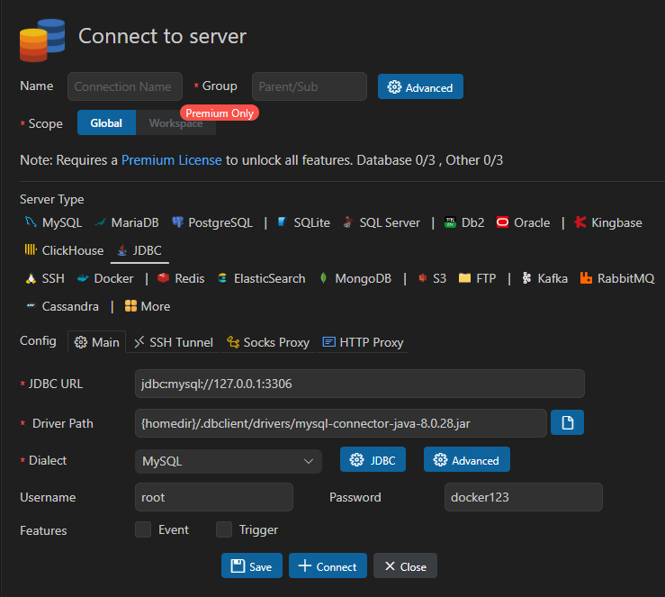
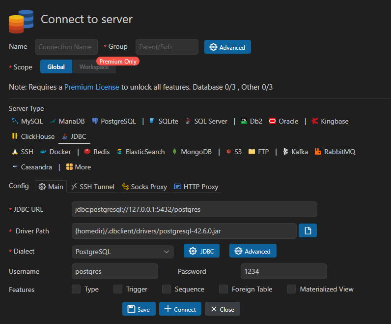
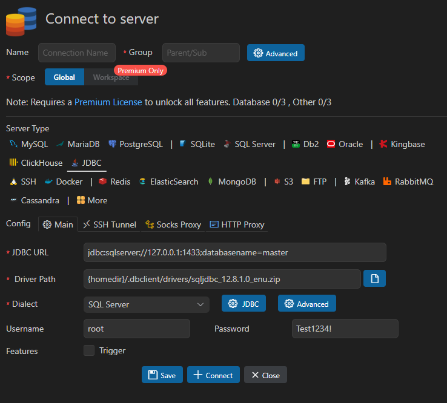
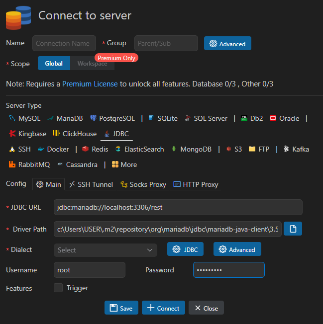

# sample-rest-basic

# 📑 목차

1. [**프로젝트 생성**](#1-프로젝트-생성)
2. [**Maven 프로젝트 + Docker 컨테이너 실행**](#2-maven-프로젝트--docker-컨테이너-실행)
3. [**Maven 프로젝트 + Docker 컨테이너 종료**](#3-maven-프로젝트--docker-컨테이너-종료docker-composeyml-사용하는-경우)
4. [**VSCode Database확장으로 DB 연결하기**](#4-vscode-database확장으로-db-연결하기)

---

## 1. 프로젝트 생성

1. `Visual Studio Code` 실행

2. `Ctrl`+`Shift`+`P` 입력

3. `Spring Initializr: Create a Maven Project` 클릭

4. 계속 엔터

5. `dependencies` 선택
    - Lombok
    - Rest Repositories
    - HyperSQL Database SQL
    - Spring Data JPA

---

## 2. Maven 프로젝트 + Docker 컨테이너 실행 

1. `docker Desktop` 실행

2. 터미널에서 Docker 실행 (**버전은 이미지 마다 다를 수 있음.**)

**MySQL**
```bash
# 이미지 다운로드
docker pull mysql:9.5.0

# 컨테이너 실행
# --name: 컨테이너 이름
# -p: 포트 매핑 (호스트:컨테이너)
# -e: 환경변수 설정
# -v: 볼륨 마운트 (호스트 경로:컨테이너 경로)
# -d: 백그라운드 실행
# 대부분 접속 되지만 접속이 안되는 경우 [allowPublicKeyRetrieval] 옵션을 true로 설정
docker run --name mydata -p 3306:3306 -e MYSQL_ROOT_PASSWORD=docker123 -v C:/Users/USER/Documents/dockerdata/mysqldata:/var/lib/mysql -d mysql:9.5.0
```

**PostgreSQL**
```bash
# 이미지 다운로드
docker pull postgres:latest

# 컨테이너 실행 (postgres 버전 <= 17)
# --name: 컨테이너 이름
# -p: 포트 매핑 (호스트:컨테이너)
# -e: 환경변수 설정
# -v: 볼륨 마운트 (호스트 경로:컨테이너 경로)
# -d: 백그라운드 실행
docker run --name postgres-db -p 5432:5432 -e POSTGRES_PASSWORD=1234 -e POSTGRES_DB=rest -v C:/Users/USER/Documents/dockerdata/postgres:/var/lib/postgresql/data -d postgres:latest

# 컨테이너 실행 (postgres 버전 >= 18)
# 볼륨 마운트 경로가 다름
docker run --name postgres -p 5432:5432 -e POSTGRES_PASSWORD=1234 -v C:/Users/USER/Documents/dockerdata/postgres:/var/lib/postgresql -d postgres:latest
``` 

**MSSQL**
```bash
# 이미지 다운로드
docker pull mcr.microsoft.com/mssql/server:2025-latest

# 컨테이너 실행 (기본 설정)
docker run --name mssql2025 -p 1433:1433 -e "ACCEPT_EULA=Y" -e "MSSQL_SA_PASSWORD=Test1234!" -v C:/Users/USER/Documents/dockerdata/mssql:/var/opt/mssql/data -d mcr.microsoft.com/mssql/server:2022-latest
```

**MariaDb**
```bash
# 이미지 다운로드 
docker pull mariadb:noble

# 컨테이너 실행
docker run --name maria -p 3306:3306 -v C:/Users/USER/Documents/dockerdata/maria:/var/lib/mysql:Z -e MARIADB_ROOT_PASSWORD=Test1234! -d mariadb:latest
```

3. 터미널에서 Spring Boot 애플리케이션 실행
```bash
# test 폴더에서는 '>' 화살표 클릭과 동일함.
.\mvnw spring-boot:run
```

---

## 3. Maven 프로젝트 + Docker 컨테이너 종료(docker-compose.yml 사용하는 경우)
```bash
docker-compose down 
```

---


## 4. VSCode **Database**확장으로 DB 연결하기

**Mysql**
1. JDBC URL : `jdbc:mysql://127.0.0.1:3306`
2. Dialect : `MySQL`
3. Driver Path : `{homedir}/.dbclient/drivers/mysql-connector-java-8.0.28.jar` => 2번 선택 시 자동 입력
4. Username : `root`
5. Password : `Docker Container`에서 지정한 비밀번호



---


**PostgresSQL**
1. JDBC URL : `jdbc:postgresql://127.0.0.1:5432/postgres`
2. Dialect : `PostgresSQL`
3. Driver Path : `{homedir}/.dbclient/drivers/postgresql-42.6.0.jar` => 2번 선택 시 자동 입력
4. Username : `postgres`(postgres의 기본 Username)
5. Password : `Docker Container`에서 지정한 비밀번호



---

**MSSQL**
1. JDBC URL : `jdbc:sqlserver://127.0.0.1:1433;databasename=master`
2. Dialect : `SQL Server`
3. Driver Path : `{homedir}/.dbclient/drivers/sqljdbc_12.8.1.0_enu.zip`
4. Username: `지정한 username`
5. Password : `Docker Container`에서 지정한 비밀번호

6. JDBC 버튼 클릭 후 `encrypt / false` `trustServerCertificate / true` 추가


---

**MariaDB**
1. JDBC URL : `jdbc:mariadb://localhost:3306/rest`
2. Dialect : `선택안해도 됨.`
3. Driver Path : `c:\Users\USER\.m2\repository\org\mariadb\jdbc\mariadb-java-client\3.5.7\mariadb-java-client-3.5.7.jar`
4. Username: `root`
5. Password : `Docker Container`에서 지정한 비밀번호



---